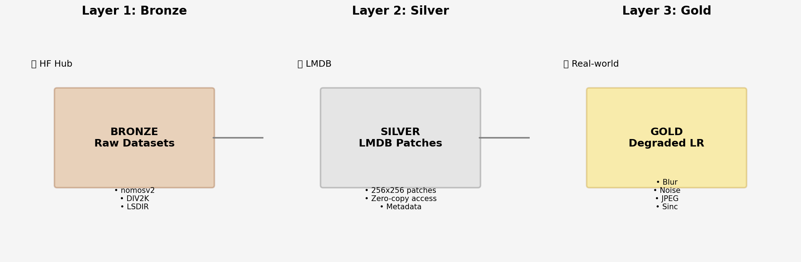
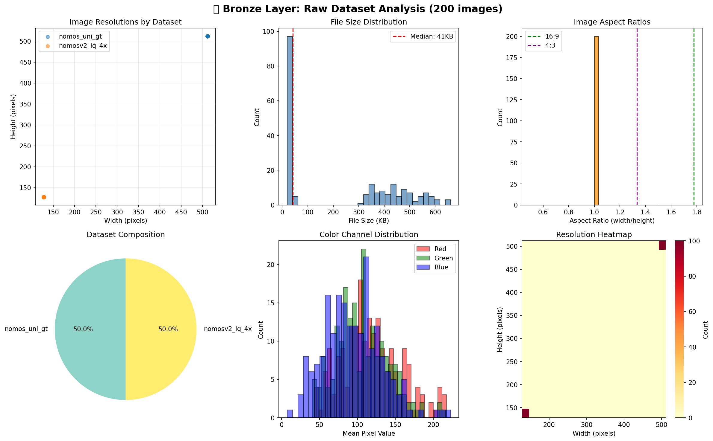
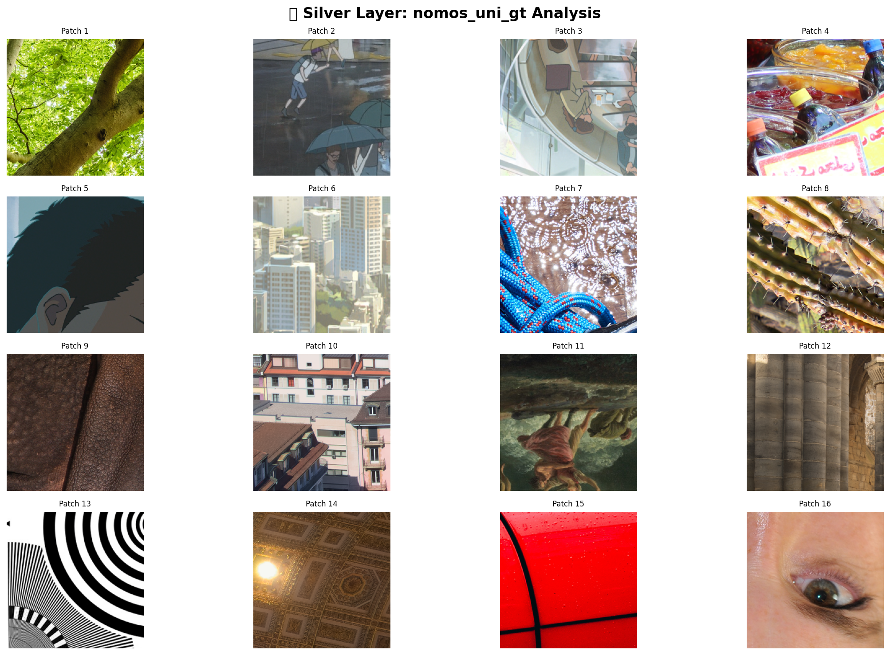
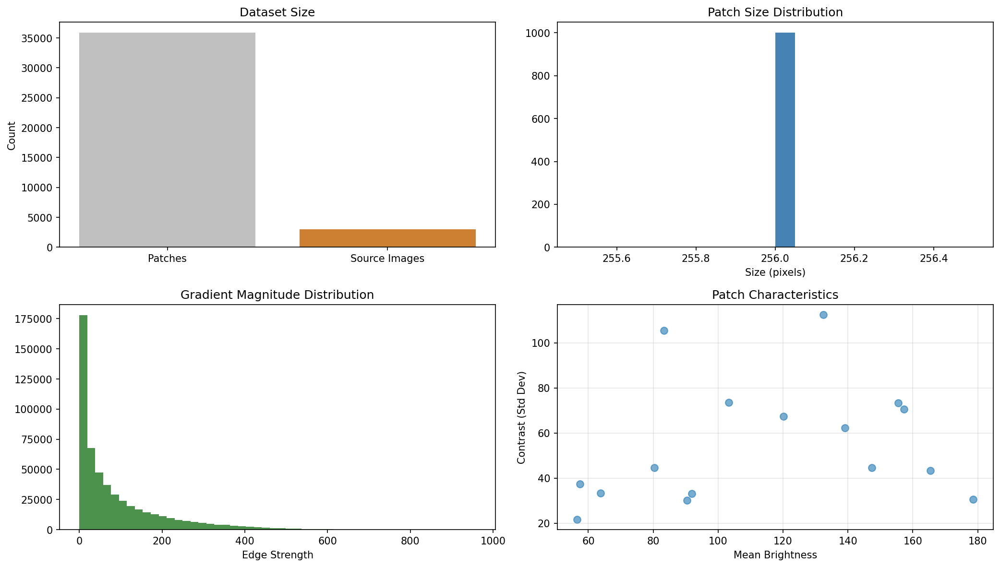
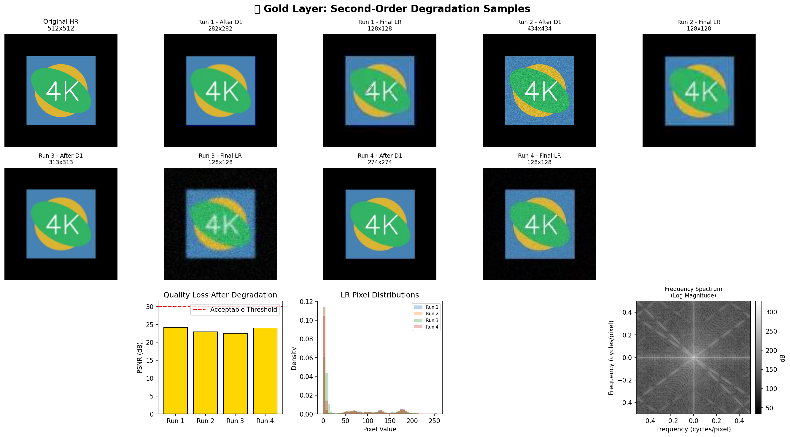
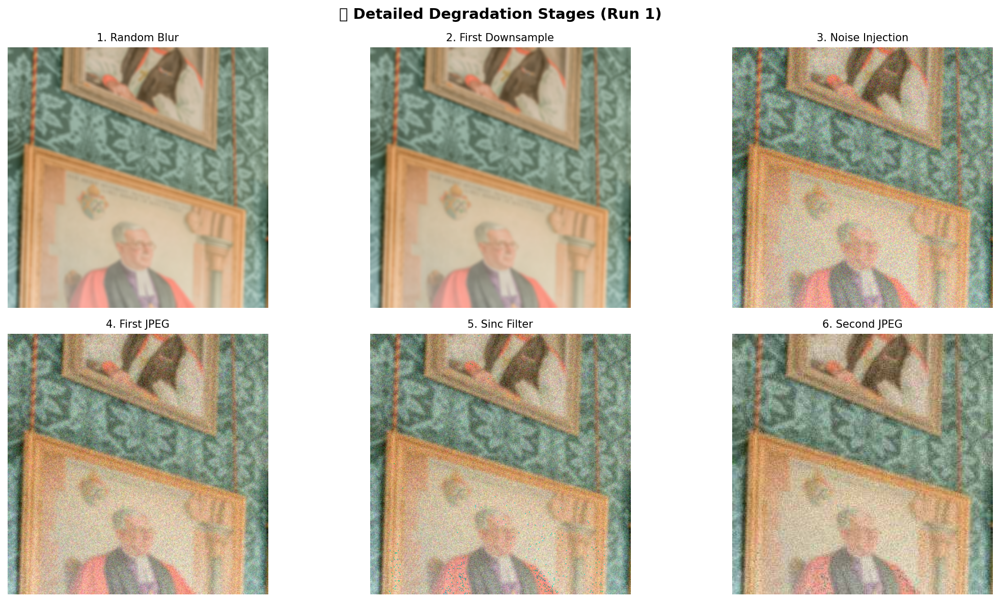
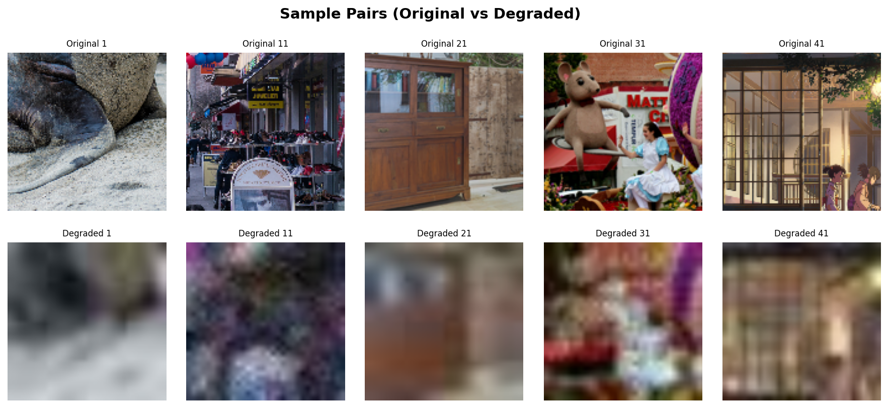
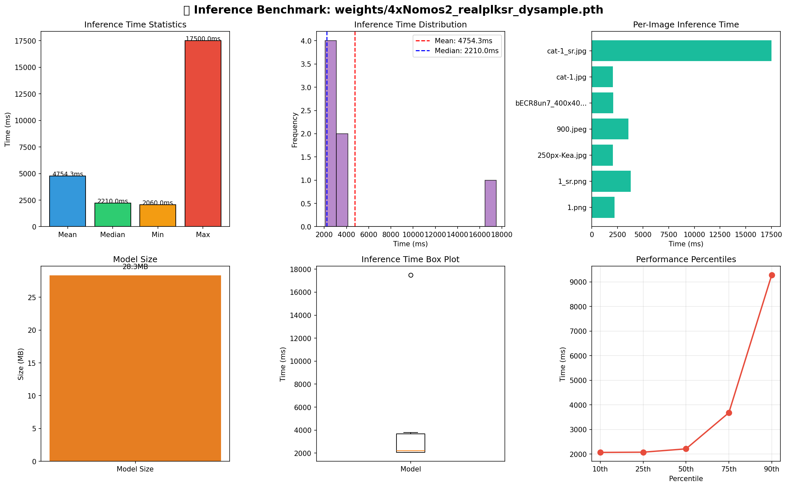

# distillSR

A super-resolution training and inference pipeline implementing second-order degradation for image restoration. Built for cross-platform deployment: Apple Silicon and NVIDIA GPUs.

## Features

- **Degradation Pipeline** - Multi-pass stochastic degradation simulating image damage through blur, noise, resizing, sinc filtering, and JPEG compression
- **Partial Large Kernel Architecture** - Channel-wise large kernel convolutions balancing receptive field expansion with computational efficiency
- **Tiled Inference** - Memory-efficient processing of arbitrarily large images with configurable halo context
- **Cross-Platform Export** - ONNX, and TensorRT support with FP16/INT8 quantization
- **LMDB Storage Layer** - High-throughput patch storage with lazy loading and validation
- **MPS Optimization** - Metal Performance Shaders compatibility & optimisations


Further doc on how it all works [here](./docs/index.md).
## Quick Start

```bash
# Clone
git clone https://github.com/hirako2000/distillSR

cd distillSR

# venv & sync dependencies
uv venv
source .venv/bin/activate  # or `uv venv --activate`
uv sync

mkdir -p data/bronze data/silver weights logs exports

# Or using just
just setup
```

## Using Just

The project includes a justfile for common operations. Install [just](https://github.com/casey/just), or use your package manager:

```bash
# macOS
brew install just

# Debian
apt install just
```

Run `just` to see available commands.

### Process

The distillSR factory implements a three-tier medallion architecture that transforms raw imagery into super-resolution models. Each tier prepares data for the next stage while maintaining provenance and quality.

## Data Pipeline

The medallion architecture transforms raw imagery into training ready patches through the three conventional tiers.

### Bronze

Raw ingestion from Hugging Face Hub with parallel downloading and image verification. No filtering preserves source integrity.



Ingested viz



### Silver

Validation filters images below 1024 pixels, segments into 256×256 patches, and stores in LMDB with PNG compression. Keys follow dataset/relative_path_row_column pattern with metadata tracking.

**Silver Tier** validates images, discarding invalid images. Valid images are segmented into 2 patches and stored in LMDB databases with compression. Each patch is indexed with dataset-relative path coordinates for zero-copy access during training.

Patch grid:



Analysis: 



### Gold

On-the-fly second-order degradation applies during training. Each iteration sees unique degradation parameters, creating an infinite dataset variant.

Degraded low-resolution is on-the-fly through second-order stochastic degradation. Each training iteration sees unique degradation parameters replicating various types of image damage.



Random blur selection from isotropic Gaussian, anisotropic Gaussian, generalized Gaussian, and plateau kernels. Gaussian or Poisson noise injects sensor artifacts. Multi-interpolation resizing with five methods simulates downsampling. JPEG compression with chroma subsampling replicates encoding artifacts. A second pass adds sinc filtering for ringing, additional blur, final downsampling to target scale, and lower-quality JPEG compression for re-upload damage.



Pairs:


## Architecture

The neural network applies large convolutions channel-wise rather than through kernel decomposition.

### Core Components
- **PLKConv2d** - Applies 13×13 or 17×17 kernels to subset of channels determined by split ratio 0.25
- **DCCM** - Doubled convolutional channel mixer with Mish activation for local texture extraction
- **Element-wise Attention** - Sigmoid-gated modulation after large kernel convolution
- **Group Normalization** - Four groups per block with constant initialization
- **DySample** - Content-aware upsampling with MPS compatibility patches

## Training

Supervised learning with stochastic degradation and multiple loss objectives.

During training, the model learns to reverse this degradation through multiple loss objectives including L1, MS-SSIM, and frequency domain losses.

### Loss Functions

- **L1 Loss** - Pixel-wise accuracy with weight 1.0
- **MS-SSIM** - Structural similarity with weight 0.2 when enabled
- **Perceptual Loss** - VGG-based LPIPS with weight 0.1 when enabled

### Optimization

- AdamW optimizer with 1e-4 learning rate and 1e-4 weight decay
- Cosine annealing to 1e-7 over total iterations
- Gradient clipping at 1.0
- Mixed precision training with GradScaler (CUDA only)

[Read more about training](./docs/training.md)

## Inference

Tiled inference processes arbitrary image sizes with configurable halo for context.

### Parameters
- **Tile Size** - 512 pixels default, balances memory and throughput
- **Halo Size** - 32 pixels context around each tile
- **Blending** - Simple averaging of overlapping regions

### Performance

Trained models deploy through tiled inference with configurable halo context, processing arbitrarily large images within memory constraints. Export to ONNX, FP16, INT8, CoreML, and TensorRT formats enables cross-platform deployment from Apple Silicon to NVIDIA GPUs.



- Image get processed in 2-4 seconds on a consumer GPU
- 4K image supported with efficient VRAM utilization, tiled automatically within memory constraints
- Benchmark mode for throughput measurement


## Export

Universal model deployment through tiered export strategy.

### Formats
- **ONNX** - Universal intermediate with opset 18 and dynamic axes
- **FP16** - Half-precision for Tensor Core acceleration
- **INT8** - Quantized for CPU inference
- **CoreML** - Apple Neural Engine optimized
- **TensorRT** - NVIDIA GPU engine with layer fusion

### Model Card
Export generates JSON metadata with architecture, parameters, training provenance, and validation metrics.
[Read more about export](./model-export.md)

## Platform Support

| Hardware | Precision | Backend | Status |
|----------|-----------|---------|--------|
| NVIDIA GPU | FP16 | TensorRT/CUDA | Production |
| Apple Silicon | BF16/FP16 | MPS/CoreML | Production |
| Intel/AMD CPU | INT8 | ONNX Runtime | Production |
| Edge/Mobile | INT8/FP8 | CoreML/ORT | Beta |

## Commands

### Data Pipeline
```bash
just list-datasets           # List available HF datasets
just download dataset        # Download to bronze layer  
just process dataset         # Process to silver LMDB
just verify dataset          # Verify LMDB integrity
just list-silver             # List processed datasets
```

### Training
```bash
just train config.yaml       # Train with config
just train-default           # Quick test training
just resume checkpoint       # Resume from checkpoint
just finetune pretrain.pt    # Fine-tune from pretrained
```

### Inference
```bash
just infer model input.jpg   # Process single image
just infer-dir model dir/     # Process directory
just benchmark model img.jpg  # Benchmark speed
just upscale input.jpg        # Quick upscale
```

### Export
```bash
just export-onnx model.pt     # Export to ONNX
just export-all model.pt      # Export all formats
just export-coreml model.pt   # Export to CoreML
just export-tensorrt model.pt # Build TensorRT engine
```

### Testing
```bash
just test-degradation         # Test degradation pipeline
just test-metrics             # Test metrics computation
just test-all                 # Run all tests
```

### Utilities
```bash
just status                   # Show pipeline status
just clean                    # Clean generated files
just clean-all                # Clean everything including data
```

## Development

```bash
# Quick test pipeline
just synthetic num=10
just process synthetic patch_size=128 min_size=256
just train-default

# Run benchmarks
just benchmark-auto
```

## Repo Structure

```
distillSR/
├── archs/                  # Model Definitions
│   ├── realplksr.py        # Core logic (Pure PyTorch)
│   └── dysample.py         # DySample Upsampler implementation
├── configs/                # Hyperparameters & Paths
│   ├── train_config.yaml   # Training/Fine-tuning settings
├── data/                   # Medallion Storage Hub
│   ├── bronze/             # Raw High-Res images (source of truth)
│   ├── silver/             # Validated & LMDB-indexed clean patches
│   └── gold?/              # At Runtime: On-the-fly degraded samples
├── pipeline/               # Engineering Scripts
│   ├── fetch_hf.py         # HF Hub image downloader
│   ├── medallion_svc.py    # Bronze -> Silver processing (LMDB/Crop)
│   └── degradations.py     # Noise and other degradation Engine
├── utils/                  # Logging & Metrics
│   ├── metrics.py          # PSNR, SSIM, LPIPS calculation
│   └── logger.py           # Weights & Biases / Local logging
├── train.py                # Main Training/Fine-tuning script (MPS optimized)
├── inference.py            # Restoration script for unseen images
└── export_onnx.py          # Post-training deployment utility
```

## Dependencies

Dependencies are managed through `pyproject.toml` and synced with `uv sync`.

## License

MIT